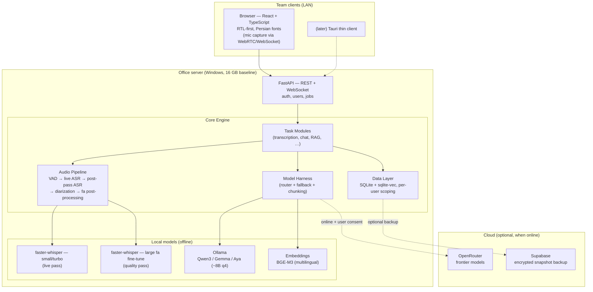

# NeurAI — Architecture (v0.2 — decisions locked)

**A Persian-first, offline-capable, multi-task AI assistant platform.**

> Status: **v0.2 — core decisions approved after review.** Changes from v0.1 are marked
> **[REVISED]**. Remaining open items are in §6.
>
> Locked decisions: **16 GB / no-GPU baseline · shared office server from day one ·
> live transcription from day one · Windows-only MVP.**

---

## 1. Product definition

NeurAI is an **on-premise team AI assistant**: one server on the office network, used by the
whole team through their browsers. It runs **fully offline** (no internet, air-gapped) and
**upgrades itself with cloud models when online**. Persian (Farsi) is the primary language;
English is secondary.

### Task modules (the "multi-task" part)

| Module | Description | Works offline? |
|---|---|---|
| **Live meeting transcription** | Live Persian speech-to-text with on-screen captions; full-quality transcript with speaker labels minutes after the meeting ends | ✅ Yes (core requirement) |
| **Meeting intelligence** | Summary, action items, decisions — generated from the transcript | ✅ local LLM / ☁️ better with cloud |
| **Chat assistant** | General Persian chat, Q&A, writing help | ✅ / ☁️ |
| **Document Q&A (RAG)** | Ask questions over your own PDFs/docs, in Persian | ✅ Yes |
| **Translation** | fa ↔ en | ✅ / ☁️ |
| *(later)* Voice commands, OCR, email drafting… | Plugin system makes these addable | — |

Each module is a **plugin over one shared core** (audio engine, model harness, storage). New
tasks = new plugins, not new apps.

---

## 2. High-level architecture



**The rule that drives everything: local is the default, cloud is an upgrade.**
The app must never break when the network disappears — cloud calls are an optimization,
not a dependency. (For our likely deployments, cloud may be unreachable *often* —
sanctions, filtered networks, air-gapped offices — so this is a hard requirement,
not a preference.)

---

## 3. Decisions

### D1 — **[REVISED]** Platform: on-premise server + browser clients (Tauri later)

**Was:** Tauri desktop app with an embedded Python sidecar.
**Now:** the Python engine *is* the product; the browser is the client.

- **Server:** Python **FastAPI** application running as a **Windows service** on the office
  server. Owns everything: ASR, diarization, harness, RAG, storage, and serving the UI.
- **Clients:** any browser on the LAN. The **React + TypeScript** UI (RTL-first) is a static
  bundle served by FastAPI — zero client install. Microphone audio streams to the server
  over WebSocket (browsers require HTTPS for mic access on non-localhost origins → the
  installer generates a self-signed cert + local hostname, documented for IT).
- **Auth:** local username/password accounts on the server (no cloud dependency), session
  cookies, per-user data scoping, one admin role. Nothing fancier for MVP.
- **Tauri thin client:** later, optional — wraps the same web UI for global-hotkey capture
  and system-tray recording. Because it's a thin shell over the server API, adding it is
  packaging work, not architecture work.
- **Single-user laptop mode:** the same engine installed locally with one auto-logged-in
  user. Same codebase, different installer preset — kept working, but not the MVP focus.

*Why this got easier:* the v0.1 plan's biggest risk was bundling a multi-GB Python sidecar
inside a desktop installer (PyInstaller + torch + antivirus false positives). A server
install is a normal Python deployment; no embedding.

### D2 — **[REVISED]** Speech pipeline: two-pass live transcription

Live from day one, on a CPU-only 16 GB box, is only feasible with a **two-pass design**:

```
LIVE PASS (during the meeting, per active meeting):
  browser mic → WebSocket → VAD (Silero) → faster-whisper SMALL/turbo model (int8, CPU)
  → rough live captions, ~2–5 s latency, no speakers

QUALITY PASS (starts when the meeting ends, queued):
  full recording → faster-whisper Persian fine-tuned large-v3 (int8)
  → speaker diarization (fully local)
  → Persian post-processing (normalization, ZWNJ, punctuation restore)
  → final transcript with timestamps + speakers replaces the live one
```

- Users see captions in real time; the **authoritative transcript with speaker labels
  arrives minutes after the meeting ends**. Live diarization is explicitly out of scope —
  it is genuinely hard even with a GPU, and the post-pass gives better labels anyway.
- **faster-whisper** (CTranslate2, int8) for both passes — no torch dependency for ASR,
  CPU-first, uses GPU automatically if the server has one.
- **Diarization licensing check is a week-0 task:** pyannote's models are gated on
  Hugging Face (per-user terms acceptance) — a problem for air-gapped redistribution.
  Benchmark **3D-Speaker** (Apache-2.0) as the default candidate; use pyannote only if
  redistribution is cleared.
**Capture modes — both supported, selectable per meeting:**

1. **Per-participant capture (distributed):** each participant joins the meeting page from
   their own laptop/phone browser; every mic stream arrives tagged with the logged-in user.
   **Speaker labels are free and exact** — no diarization needed; the server mixes streams
   for the recording. Best for hybrid/remote meetings.
2. **Room-mic capture (single device):** one device in the room captures everyone; the
   quality pass runs diarization ("Speaker 1/2/3") and then **speaker identification** maps
   anonymous speakers to names, via three complementary mechanisms:
   - **Enrollment round:** the meeting can open with a short introduction round («سلام، من
     … هستم») — the engine cuts a voice sample per person and matches the rest of the
     meeting against those fingerprints (speaker embeddings, e.g. ECAPA/3D-Speaker).
   - **Persistent voice profiles (opt-in):** a user can save a ~30-second voice profile on
     their account; recurring participants are then recognized automatically in any room
     meeting, no intro round needed. Profiles are embeddings stored locally on the server,
     deletable by the user.
   - **Manual relabel (always available):** in the transcript view, click any segment →
     assign a name → it propagates to that speaker's segments. This is the safety net when
     identification is wrong or a guest never enrolled.

- Persian model bake-off in week 0: [vhdm/whisper-large-fa-v1](https://huggingface.co/vhdm/whisper-large-fa-v1),
  `whisper-large-v3-turbo`, Qwen3-ASR — **benchmarked on real meeting recordings**
  (far-field mics, overlapping speech, fa/en code-switching), not clean benchmark audio.
  Published WER (~14%) will not survive contact with a conference room; measure honestly.
- Model files download **once** through the Model Manager, then everything runs air-gapped.

### D3 — Model Harness (router + fallback + **[REVISED]** chunking, consent-gated cloud)

One internal interface `complete(task, messages, constraints)` that every task module calls.
The harness decides **which model actually serves the request**:

```
Request → Policy check:
  1. No network, or workspace is local-only?      → local model (Ollama)
  2. Cloud not enabled for this workspace?        → local model
  3. Cloud enabled + task benefits from it?       → OpenRouter
  4. Cloud call fails/times out?                  → automatic fallback to local
```

- **[REVISED] Cloud is consent-gated, not heuristic:** meeting content never leaves the
  server unless the admin has enabled cloud for that workspace *and* the user opted the
  meeting in. The 🏠 local / ☁️ cloud badge on every response stays, but it confirms a
  choice — it is not an after-the-fact disclosure.
- **[REVISED] The harness owns long-input strategies, not just routing.** A 2-hour meeting
  is ~20–30k tokens; that exceeds the usable context of an 8B model on our baseline server.
  The harness implements **map-reduce summarization** (chunk → per-chunk notes → merge) so
  "fallback to local" actually works on the tasks that matter most.
- **Cloud side: OpenRouter** — one API key, every frontier model, easy A/B and swaps. The
  default cloud model is one config line; re-verify current models/pricing at build time
  rather than baking numbers into this doc.
- **Local side: Ollama** on the server. Baseline (16 GB, no GPU): **~8B model at q4**
  (Qwen3-8B / Gemma-12B-class / Aya Expanse 8B — Persian quality decided by the week-0
  bake-off). Servers with 32 GB+/GPU step up to ~32B automatically via hardware detection.

### D4 — Data layer: **[REVISED]** local-first SQLite, snapshot backup (not sync)

- **Source of truth = SQLite** on the server: meetings, transcripts, chats, users, settings.
  Zero-setup, works air-gapped, trivially backed up. (Server-side SQLite with WAL handles a
  small team's write load fine; Postgres is a later option if a deployment outgrows it.)
- **Vector search = sqlite-vec** + **BGE-M3 embeddings** (strong multilingual incl.
  Persian, runs locally). Brute-force search — completely fine at team-corpus scale.
- **[REVISED] Supabase scope cut from "sync" to "backup":** a bidirectional sync engine
  with offline replay is a project in itself (conflicts, migrations, partial failures).
  MVP+1 ships **client-side-encrypted snapshot backup/restore** instead — 90% of the value,
  10% of the complexity. True E2E means we encrypt *before* upload; Supabase never sees
  plaintext. Full sync only if a real deployment demands it. Off by default, never required.

### D5 — Persian-first engineering (not an afterthought)

- **UI:** RTL-first layout (LTR is the special case), Vazirmatn font, Persian digits toggle,
  Jalali (Shamsi) calendar for meeting dates.
- **Text pipeline:** normalization (ی/ک unification, ZWNJ «نیم‌فاصله» handling,
  Arabic→Persian char mapping) applied to *both* ASR output and LLM output. Hazm/Parsivar
  are aging projects — **pin versions and wrap them behind our own `fa_normalize()`
  interface** so they can be swapped without touching modules.
- **Prompting:** system prompts engineered and evaluated in Persian; a small Persian eval
  set (transcription WER + summary quality) runs in CI so regressions get caught.
- **Mixed-language reality:** meetings mix Persian + English tech terms — code-switching is
  a scored criterion in the D2 bake-off.

### D6 — Repo & delivery

- **Monorepo**, public on GitHub:
  ```
  neurai/
  ├── server/              # Python FastAPI engine (ASR, harness, RAG, auth) — the product
  ├── webui/               # React + TypeScript client (served by the server)
  ├── clients/desktop/     # (later) Tauri thin client
  ├── docs/                # this file, ADRs, benchmark results
  └── .github/workflows/   # CI: lint, tests, Persian eval set, server installer build
  ```
- **Shared types:** generated from the FastAPI/Pydantic OpenAPI schema → TS client
  (`openapi-typescript`); no hand-maintained JSON schema.
- **Windows-only MVP:** the server ships as a Windows service installer (engine + models
  directory + cert setup). Linux server support is a natural follow-up and cheap for a
  normal Python deployment.
- License: **TBD — Apache-2.0 recommended** (MIT-equivalent in practice, plus an explicit
  patent grant).

---

## 4. Capacity planning (16 GB, no-GPU baseline)

**Target: 1 live meeting at a time** (decided). This makes the baseline comfortable:

| Load | Feasible on baseline? |
|---|---|
| 1 live meeting (small-model live pass) | ✅ comfortable — the design target |
| Quality pass (large model) | ✅ queued after the meeting, ~faster than realtime on modern CPU |
| Local LLM summary during a live meeting | ⚠️ RAM/CPU contention — summaries queue behind live ASR by design |

Rules encoded in the engine: the live meeting gets priority; quality passes and LLM jobs
run from a queue; the admin dashboard shows the queue. If a second meeting is started while
one is live, the engine refuses with a clear message («جلسه‌ای در حال ضبط است») rather than
degrading both. Multi-meeting concurrency is a config cap, not an architectural limit —
a GPU or bigger box raises it later without code changes.

---

## 5. Build roadmap

| Phase | Deliverable | Definition of done |
|---|---|---|
| **0. Benchmarks** (~week 1) | Persian ASR + local-LLM bake-off on *real meeting audio*; diarization + speaker-embedding license check; live-meeting load test on the 16 GB baseline | Chosen default models with measured WER/quality; capacity table validated |
| **1. Live transcriber on the server** | Server install + browser client, **room-mic mode**: live captions, quality pass with diarized speakers + manual relabel; auth + per-user meetings | Two users, WiFi router with no internet, full meeting transcribed and speakers named by hand |
| **2. Harness + intelligence** | Ollama routing + map-reduce summaries, action items; OpenRouter behind consent gate; **speaker ID** (enrollment round + voice profiles) and **per-participant capture mode** | Fallback proven by pulling the network cable mid-task; a recurring participant auto-named in room mode |
| **3. Chat + RAG** | Persian chat; Q&A over transcripts & PDFs | Answers cite sources |
| **4. Backup + polish** | Encrypted snapshot backup (optional), model manager, admin dashboard, Windows service installer | One-command install on a clean Windows machine |
| **5. Thin clients** | Tauri desktop wrapper (hotkeys, tray recording); single-user laptop preset | Same server codebase, no forks |

---

## 6. Remaining open questions

1. **Server OS reality check:** is the office server actually Windows, or would a Docker/
   Linux deployment be acceptable? (Windows service confirmed for MVP; Docker is cheap to
   add and eases Linux later.)
2. **License:** Apache-2.0 vs MIT — Apache-2.0 recommended, needs a final call.

**Resolved since v0.2:** concurrency target = 1 live meeting at a time (§4); mic strategy =
both capture modes, selectable per meeting, with speaker identification via enrollment
round / voice profiles / manual relabel (§3 D2).
