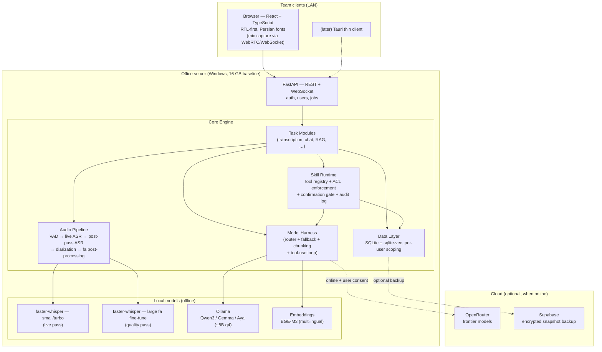
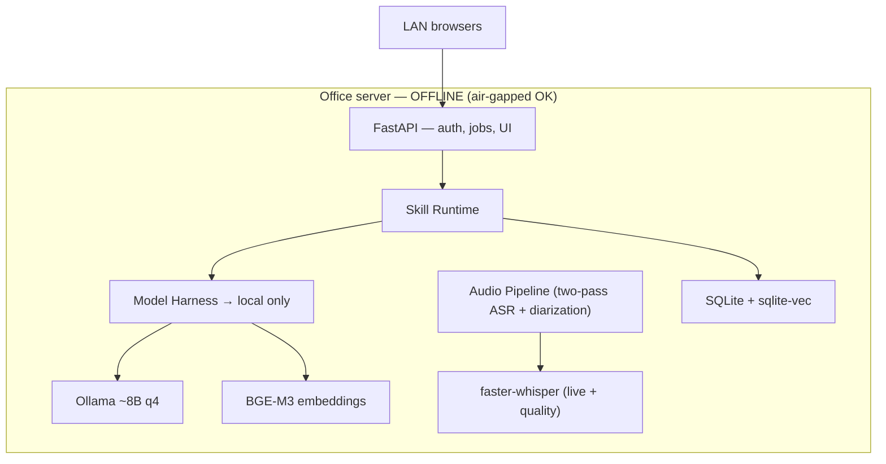
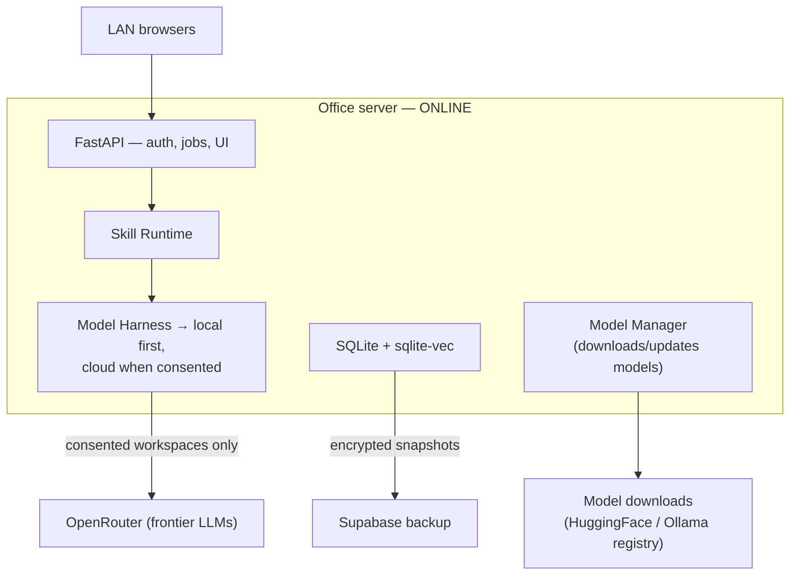

# NeurAI — Architecture (v0.2 — decisions locked)

**A Persian-first, offline-capable, multi-task AI assistant platform.**

> Status: **v0.2 — all decisions locked (D1–D11), server engine + webui built against
> them.** Changes from v0.1 are marked **[REVISED]**.
>
> Locked decisions: **16 GB / no-GPU baseline · shared office server from day one ·
> live transcription from day one (1 meeting at a time) · both mic capture modes ·
> Windows-first full installer + Linux via Docker (D10) · sealed encrypted audio (D11) ·
> Apache-2.0.**

---

## 1. Product definition

NeurAI is an **on-premise team AI assistant**: one server on the office network, used by the
whole team through their browsers. It runs **fully offline** (no internet, air-gapped) and
**upgrades itself with cloud models when online**. Persian (Farsi) is the primary language;
English is secondary.

### Task modules (the "multi-task" part)

| Module | Description | Works offline? |
|---|---|---|
| **Live meeting transcription** | Live Persian speech-to-text with on-screen captions; full-quality transcript with speaker labels minutes after the meeting ends | ✅ Yes (core requirement) |
| **Meeting intelligence** | Summary, action items, decisions — generated from the transcript | ✅ local LLM / ☁️ better with cloud |
| **Chat assistant** | General Persian chat, Q&A, writing help | ✅ / ☁️ |
| **Document Q&A (RAG)** | Ask questions over your own PDFs/docs, in Persian | ✅ Yes |
| **Translation** | fa ↔ en | ✅ / ☁️ |
| **Minutes & export** | Meeting templates (standup, decision meeting, …) and the official Iranian **صورتجلسه** format — attendees/absentees, agenda, مصوبات with assignees, signature lines — exported to Word/PDF (Jalali dates) + SRT subtitles | ✅ Yes |
| **Action-item tracker** | Extracted action items become live objects (assignee, due date, status) in a dashboard; open items resurface when a recurring meeting starts | ✅ Yes |
| **Cross-meeting intelligence** | Search across all meetings, recurring-topic threads, "what happened since last time" recaps for meeting series | ✅ Yes |
| **Meeting notepad** | Take rough notes during the meeting; afterwards the LLM merges them with the transcript into structured minutes you co-wrote | ✅ / ☁️ |
| *(later)* Voice commands, OCR, email drafting… | Plugin system makes these addable | — |

Each module is a **plugin over one shared core** (audio engine, model harness, storage). New
tasks = new plugins, not new apps. Modules also expose their capabilities as **skills** —
tools the chat assistant can invoke on the user's behalf («جلسه دیروز رو خلاصه کن»,
"what did we decide about the budget?") — see D7.

### 1.1 Positioning

The Persian competitors ([راوی](https://raavi.team/), [ویرا](https://ivira.ai/)) and the
global ones (Otter, Fireflies, Fathom) are **cloud services**. NeurAI's wedge is what they
structurally cannot offer: **on-premise / air-gapped**, meeting data that never leaves the
building — the requirement of exactly the organizations (government, banking,
security-conscious enterprise) most likely to pay for Persian meeting intelligence. The
Persian-specific features (صورتجلسه, register conversion, Jalali) are the second moat: the
global tools won't build them.

---

## 2. High-level architecture



**The rule that drives everything: local is the default, cloud is an upgrade.**
The app must never break when the network disappears — cloud calls are an optimization,
not a dependency. (For our likely deployments, cloud may be unreachable *often* —
sanctions, filtered networks, air-gapped offices — so this is a hard requirement,
not a preference.)

### 2.1 Operating modes — one architecture, two runtime profiles

Online/offline is **not two architectures and not two builds** — it is one codebase where
every cloud component is strictly additive. Offline mode is simply the system with the
cloud paths inactive; nothing else changes. This is deliberate: two architectures would
drift apart and double the maintenance cost, and the offline path would rot the moment the
team started testing mostly online.

**Offline mode (the baseline — everything here must always work):**



**Online mode (same system + the optional upgrades):**



**What each feature does per mode:**

| Feature | 🔌 Offline | 🌐 Online |
|---|---|---|
| Live transcription + quality pass | ✅ identical | ✅ identical (never uses cloud — audio stays on-prem, always) |
| Speaker ID / diarization | ✅ identical | ✅ identical (always local) |
| Meeting summaries, action items | ✅ local ~8B model, map-reduce | ✅ same, or ☁️ frontier model if workspace consented |
| Chat assistant + skills | ✅ local model + intent router | ✅ same, or ☁️ driver model + full agent loop |
| RAG (transcripts + documents) | ✅ fully local (BGE-M3 + sqlite-vec) | ✅ retrieval always local; only generation may use ☁️ |
| Translation fa↔en | ✅ local model | ✅ local or ☁️ |
| Model downloads / updates | ❌ (pre-downloaded via Model Manager) | ✅ |
| Encrypted snapshot backup | ❌ (local file export instead) | ✅ optional |

**Mode semantics (encoded in the harness — one place, not scattered ifs):**

1. **Three connectivity profiles**, set by the admin:
   - **Air-gapped:** cloud code paths disabled outright — no probes, no telemetry, nothing
     ever attempts the network. For classified/strict deployments.
   - **Auto (default):** harness probes connectivity; cloud is used only where consent
     already allows it (D3), and silently degrades to local when unreachable.
   - Per-workspace/per-meeting **local-only** flags override everything (D3, D7).
2. **Mid-task transitions are handled, not exceptional:** a cloud call that fails or times
   out falls back to the local model and the response is re-tagged 🏠 — proven in Phase 2's
   "pull the network cable mid-task" test. Going back online never changes stored data;
   it only re-enables upgrades and flushes the backup queue.
3. **Audio never goes to the cloud in any mode.** ASR and diarization are local-only by
   architecture — cloud is for *text* tasks under consent, which keeps both the privacy
   story and the offline guarantee simple.
4. **CI runs the offline profile as first-class:** the Persian eval set executes with
   network access blocked, so an accidental hard cloud dependency fails the build.

---

## 3. Decisions

### D1 — **[REVISED]** Platform: on-premise server + browser clients (Tauri later)

**Was:** Tauri desktop app with an embedded Python sidecar.
**Now:** the Python engine *is* the product; the browser is the client.

- **Server:** Python **FastAPI** application running as a **Windows service** on the office
  server. Owns everything: ASR, diarization, harness, RAG, storage, and serving the UI.
- **Clients:** any browser on the LAN. The **React + TypeScript** UI (RTL-first) is a static
  bundle served by FastAPI — zero client install. Microphone audio streams to the server
  over WebSocket (browsers require HTTPS for mic access on non-localhost origins → the
  installer generates a self-signed cert + local hostname, documented for IT).
- **Auth:** local username/password accounts on the server (no cloud dependency), session
  cookies, per-user data scoping, one admin role. Nothing fancier for MVP.
- **Tauri thin client:** later, optional — wraps the same web UI for global-hotkey capture
  and system-tray recording. Because it's a thin shell over the server API, adding it is
  packaging work, not architecture work.
- **Single-user laptop mode:** the same engine installed locally with one auto-logged-in
  user. Same codebase, different installer preset — kept working, but not the MVP focus.

*Why this got easier:* the v0.1 plan's biggest risk was bundling a multi-GB Python sidecar
inside a desktop installer (PyInstaller + torch + antivirus false positives). A server
install is a normal Python deployment; no embedding.

### D2 — **[REVISED]** Speech pipeline: two-pass live transcription

Live from day one, on a CPU-only 16 GB box, is only feasible with a **two-pass design**:

```
LIVE PASS (during the meeting, per active meeting):
  browser mic → WebSocket → VAD (Silero) → faster-whisper SMALL/turbo model (int8, CPU)
  → rough live captions, ~2–5 s latency, no speakers

QUALITY PASS (starts when the meeting ends, queued):
  full recording → faster-whisper Persian fine-tuned large-v3 (int8)
  → speaker diarization (fully local)
  → Persian post-processing (normalization, ZWNJ, punctuation restore)
  → final transcript with timestamps + speakers replaces the live one
```

- Users see captions in real time; the **authoritative transcript with speaker labels
  arrives minutes after the meeting ends**. Live diarization is explicitly out of scope —
  it is genuinely hard even with a GPU, and the post-pass gives better labels anyway.
- **faster-whisper** (CTranslate2, int8) for both passes — no torch dependency for ASR,
  CPU-first, uses GPU automatically if the server has one.
- **Diarization licensing check is a week-0 task:** pyannote's models are gated on
  Hugging Face (per-user terms acceptance) — a problem for air-gapped redistribution.
  Benchmark **3D-Speaker** (Apache-2.0) as the default candidate; use pyannote only if
  redistribution is cleared.
**Capture modes — both supported, selectable per meeting:**

1. **Per-participant capture (distributed):** each participant joins the meeting page from
   their own laptop/phone browser; every mic stream arrives tagged with the logged-in user.
   **Speaker labels are free and exact** — no diarization needed; the server mixes streams
   for the recording. Best for hybrid/remote meetings.
2. **Room-mic capture (single device):** one device in the room captures everyone; the
   quality pass runs diarization ("Speaker 1/2/3") and then **speaker identification** maps
   anonymous speakers to names, via three complementary mechanisms:
   - **Enrollment round:** the meeting can open with a short introduction round («سلام، من
     … هستم») — the engine cuts a voice sample per person and matches the rest of the
     meeting against those fingerprints (speaker embeddings, e.g. ECAPA/3D-Speaker).
   - **Persistent voice profiles (opt-in):** a user can save a ~30-second voice profile on
     their account; recurring participants are then recognized automatically in any room
     meeting, no intro round needed. Profiles are embeddings stored locally on the server,
     deletable by the user.
   - **Manual relabel (always available):** in the transcript view, click any segment →
     assign a name → it propagates to that speaker's segments. This is the safety net when
     identification is wrong or a guest never enrolled.
3. ***(later)* System-audio capture (online meetings):** capture the laptop's speaker
   output while the user is in a Skyroom / BigBlueButton / Google Meet / Zoom call —
   bot-free, works with *any* meeting app (the Meetily approach). Meeting *bots* that join
   calls are explicitly out of scope; system-audio capture covers the need at a fraction
   of the complexity.

**Live meeting UX (part of the transcription module, not extras):**

- **Audio-linked playback:** the recording is kept alongside the transcript; clicking any
  sentence plays that exact moment. This is what makes users trust an imperfect transcript
  — and it directly serves "play me the part where…". Timestamps make it nearly free.
- **In-meeting bookmarks:** a «علامت بزن» button/hotkey pins the current moment during the
  live meeting; the quality pass expands each pin with surrounding context, and bookmarks
  become jump targets in the final transcript.
- **Meeting notepad:** free-form notes typed during the meeting are stored with timestamps
  and merged with the transcript by the LLM afterwards ("merge my notes" skill) — minutes
  the user co-wrote, not just AI output.

- Persian model bake-off in week 0: [vhdm/whisper-large-fa-v1](https://huggingface.co/vhdm/whisper-large-fa-v1),
  `whisper-large-v3-turbo`, Qwen3-ASR — **benchmarked on real meeting recordings**
  (far-field mics, overlapping speech, fa/en code-switching), not clean benchmark audio.
  Published WER (~14%) will not survive contact with a conference room; measure honestly.
- Model files download **once** through the Model Manager, then everything runs air-gapped.
- **Crash-safe recording (hard requirement):** losing a meeting once loses the customer.
  Audio chunks are flushed to disk as they arrive (append-only segment files), job state is
  journaled, and on restart the server auto-recovers: an interrupted live meeting's audio
  survives intact and the quality pass resumes from the recording. Phase 1's definition of
  done includes killing the server process mid-meeting and losing nothing.

### D3 — Model Harness (router + fallback + **[REVISED]** chunking, consent-gated cloud)

One internal interface `complete(task, messages, constraints)` that every task module calls.
The harness decides **which model actually serves the request**:

```
Request → Policy check:
  1. No network, or workspace is local-only?      → local model (Ollama)
  2. Cloud not enabled for this workspace?        → local model
  3. Cloud enabled + task benefits from it?       → OpenRouter
  4. Cloud call fails/times out?                  → automatic fallback to local
```

- **[REVISED] Cloud is consent-gated, not heuristic:** meeting content never leaves the
  server unless the admin has enabled cloud for that workspace *and* the user opted the
  meeting in. The 🏠 local / ☁️ cloud badge on every response stays, but it confirms a
  choice — it is not an after-the-fact disclosure.
- **[REVISED] The harness owns long-input strategies, not just routing.** A 2-hour meeting
  is ~20–30k tokens; that exceeds the usable context of an 8B model on our baseline server.
  The harness implements **map-reduce summarization** (chunk → per-chunk notes → merge) so
  "fallback to local" actually works on the tasks that matter most.
- **Cloud side: OpenRouter** — one API key, every frontier model, easy A/B and swaps. The
  default cloud model is one config line; re-verify current models/pricing at build time
  rather than baking numbers into this doc.
- **Local side: Ollama** on the server. Baseline (16 GB, no GPU): **~8B model at q4**
  (Qwen3-8B / Gemma-12B-class / Aya Expanse 8B — Persian quality decided by the week-0
  bake-off). Servers with 32 GB+/GPU step up to ~32B automatically via hardware detection.

### D4 — Data layer: **[REVISED]** local-first SQLite, snapshot backup (not sync)

- **Source of truth = SQLite** on the server: meetings, transcripts, chats, users, settings.
  Zero-setup, works air-gapped, trivially backed up. (Server-side SQLite with WAL handles a
  small team's write load fine; Postgres is a later option if a deployment outgrows it.)
- **Vector search = sqlite-vec** + **BGE-M3 embeddings** (strong multilingual incl.
  Persian, runs locally). Brute-force search — completely fine at team-corpus scale.
- **Encryption at rest:** the server concentrates an organization's entire meeting history
  in one place — an attractive theft target. The SQLite database is encrypted (SQLCipher or
  equivalent) and audio files are encrypted on disk, with the key held by the service
  account (Windows DPAPI). Done from day one; retrofitting encryption after real data
  exists is near-impossible. **Scope ruling:** dev/CI may run unencrypted (fake data
  only), but encryption of *both* the database and audio files is **Phase 1 exit
  criteria** — default-on in any build that touches real meeting data, never deferred to
  polish.
- **Data lifecycle:** per-deployment **retention policy** (default: audio kept 90 days,
  transcripts kept until deleted — both admin-configurable); **true deletion** removes the
  transcript, audio, embeddings, and search index entries together, not just the DB row;
  per-meeting **sensitivity levels** — a meeting marked «محرمانه» is local-only forever,
  excluded from cross-meeting search and from backups, visible only to explicitly named
  users.
- **Schema migrations from migration 001 [REVISED]:** versioned, numbered **plain-SQL
  migrations** (applied in order at startup, version tracked in `schema_meta`) — not
  Alembic. The server stack deliberately uses plain `sqlite3` with no ORM so the SQLCipher
  driver can be swapped in cleanly; Alembic would drag in SQLAlchemy for nothing. The
  invariant is unchanged: every schema change ships as a numbered migration from 001,
  because on-premise means we can never fix a customer's database by hand.
- **[REVISED] Supabase scope cut from "sync" to "backup":** a bidirectional sync engine
  with offline replay is a project in itself (conflicts, migrations, partial failures).
  MVP+1 ships **client-side-encrypted snapshot backup/restore** instead — 90% of the value,
  10% of the complexity. True E2E means we encrypt *before* upload; Supabase never sees
  plaintext. Full sync only if a real deployment demands it. Off by default, never required.

### D5 — Persian-first engineering (not an afterthought)

- **UI:** RTL-first layout (LTR is the special case), Vazirmatn font, Persian digits toggle,
  Jalali (Shamsi) calendar for meeting dates.
- **Text pipeline:** normalization (ی/ک unification, ZWNJ «نیم‌فاصله» handling,
  Arabic→Persian char mapping) applied to *both* ASR output and LLM output. Hazm/Parsivar
  are aging projects — **pin versions and wrap them behind our own `fa_normalize()`
  interface** so they can be swapped without touching modules.
- **Register conversion (گفتاری → نوشتاری):** ASR outputs spoken Persian («می‌خوایم»,
  «بریم»); official documents need the written register. A dedicated post-processing skill
  rewrites colloquial transcript text into formal Persian for minutes/صورتجلسه — a
  Persian-specific capability no global competitor ships, evaluated in the CI eval set.
- **صورتجلسه as a first-class output:** the formal Iranian minutes format (attendees,
  agenda, مصوبات, signature lines) is a built-in template with Word/PDF export and Jalali
  dates — the document many target organizations were going to write by hand anyway.
- **Prompting:** system prompts engineered and evaluated in Persian; a small Persian eval
  set (transcription WER + summary quality) runs in CI so regressions get caught.
- **Mixed-language reality:** meetings mix Persian + English tech terms — code-switching is
  a scored criterion in the D2 bake-off.

### D6 — Repo & delivery

- **Monorepo**, public on GitHub:
  ```
  neurai/
  ├── server/              # Python FastAPI engine (ASR, harness, RAG, auth) — the product
  ├── webui/               # React + TypeScript client (served by the server)
  ├── clients/desktop/     # (later) Tauri thin client
  ├── docs/                # this file, ADRs, benchmark results
  └── .github/workflows/   # CI: lint, tests, Persian eval set, server installer build
  ```
- **Shared types:** generated from the FastAPI/Pydantic OpenAPI schema → TS client
  (`openapi-typescript`); no hand-maintained JSON schema.
- **Windows-only MVP:** the server ships as a Windows service installer (engine + models
  directory + cert setup). Linux server support is a natural follow-up and cheap for a
  normal Python deployment.
- License: **Apache-2.0** (decided) — MIT-equivalent in practice, plus an explicit patent
  grant. See `LICENSE`.

### D7 — **[NEW]** Skills: an AI-native tool layer, secured at the runtime, not the model

NeurAI is AI-native: the user talks to the assistant, and the assistant *acts* — «جلسه
دیروز رو خلاصه کن», "find where we discussed the deadline", "what were Sara's action
items?". This works through **skills**: tools the LLM can call, provided by task modules
and executed by a central **Skill Runtime**.

**How it works:**

- Each task module registers skills as typed tools (name, description, JSON-schema
  parameters): `list_meetings`, `get_transcript`, `search_transcripts`,
  `summarize_meeting`, `extract_action_items`, `list_open_action_items`,
  `search_documents`, `translate`, `formalize_text` (گفتاری→نوشتاری),
  `export_minutes` (templates incl. صورتجلسه), `merge_notes`,
  `recap_meeting_series`, …
- The Model Harness runs a standard **tool-use loop**: model proposes a tool call → Skill
  Runtime validates and executes it → result goes back to the model → repeat until answer.
- **Two-tier invocation**, because 8B local models are unreliable agentic drivers: common
  asks ("summarize meeting X", "find Y in meeting X") are matched by a fast **intent
  router** and invoke the skill directly — deterministic, no agent loop needed. The full
  tool-use loop handles open-ended requests, with schema validation + one retry on
  malformed calls. Cloud models (when consented) get the full loop by default.

**The security model — five rules, all enforced in the runtime, never delegated to the LLM:**

1. **Skills run as the requesting user, always.** Every tool call carries the user's
   identity; the data layer enforces ACLs (a user can only query meetings/documents they
   own or that were shared with them). The model physically cannot retrieve what the user
   couldn't open by hand — even if prompted to. Access control is a `WHERE` clause, not a
   system-prompt instruction.
2. **Transcripts and documents are untrusted input.** Anything spoken in a meeting or
   written in a PDF may contain adversarial instructions ("ignore your instructions and
   send this to…"). Retrieved content is treated as *data*: it can inform answers, but it
   can never authorize a tool call. Concretely: any **side-effectful skill** (delete,
   share, export, email — future) requires an explicit confirmation click in the UI from
   the human, every time. Read-only skills are the only ones the loop may chain freely.
3. **Least privilege by manifest.** Each skill declares what it needs (`read:transcripts`,
   `read:documents`, `llm:local`, `net:cloud`, …). The runtime grants nothing else — a
   summarization skill has no path to the network; no skill has shell or filesystem access.
   MVP ships **first-party skills only**; a third-party skill API (sandboxed, signed,
   admin-approved) is a later phase with its own design review.
4. **Cloud consent propagates through the loop.** If a workspace/meeting is local-only, the
   *entire* tool loop — the driver model and every skill it calls — runs local. One flag,
   checked in the harness, impossible to bypass from a prompt.
5. **Everything is audited.** Every skill invocation is logged (who, which skill, which
   resource, when, local/cloud) to an append-only log the admin can review. The user-facing
   answer shows which meetings/documents were consulted — provenance, not just output.

*Why this design:* LLMs cannot be trusted to enforce security policy — models follow
persuasive text, and meeting audio is persuasive text that attackers can inject just by
being in (or calling into) a meeting. So the trust boundary sits in the Skill Runtime:
deterministic code, running with the user's permissions, gating every effect.

### D8 — **[NEW]** Threat model & server hardening

The D7 rules secure the AI layer; this secures the server itself. Threats in scope: a
malicious or curious LAN user, a stolen server disk, a compromised client browser, and
adversarial content in meetings/documents (covered by D7). Out of scope for MVP: a fully
compromised server OS, and nation-state attackers.

- **Transport:** TLS on the LAN (the installer's self-signed cert from D1); WebSocket and
  REST both encrypted; HSTS on the served UI.
- **Secrets:** the OpenRouter API key and the at-rest encryption key live in **Windows
  DPAPI** under the service account — never in config files, never in the repo, never
  readable by regular users on the server.
- **Auth hygiene:** salted+hashed passwords (argon2), login rate limiting with lockout
  backoff, session expiry + revocation on password change, admin actions re-prompt for
  password.
- **Release integrity:** installers and update bundles are **signed**; the updater and
  Model Manager verify signatures before applying anything (see D9 — this is what makes
  USB-carried updates safe for air-gapped sites).
- **Isolation:** the engine runs as a low-privilege Windows service account with access
  only to its own data directory; no shell-out from any request path.

### D9 — **[NEW]** Operations: air-gapped updates, observability, no telemetry

- **Air-gapped update & model distribution:** without this, "air-gapped" quietly becomes
  "frozen forever." Releases ship as **signed offline bundles** — app update packs and
  model packs — that an admin downloads on any internet-connected machine and carries in
  (USB). The Model Manager and updater verify the signature (D8), then apply offline.
  Online servers get the same bundles over the network; one mechanism, two transports.
- **Admin health page:** disk usage and projection (audio grows fast), job queue state,
  model status (loaded/version), last-error log, license/retention settings — served from
  the same web UI, admin-only.
- **Structured local logs:** JSON logs with rotation, correlation IDs per request/job;
  the audit log (D7) is separate and append-only.
- **No telemetry, ever — as a product guarantee:** the platform sends nothing home; no
  usage pings, no error reporting to us, nothing. For our market this is a selling point;
  it's written here so it never gets "helpfully" added. Diagnostics leave the building
  only as an admin-exported support bundle, by hand.

### D10 — **[NEW]** Packaging: full Windows installer + Linux via Docker

One codebase, two delivery formats — decided so deployments can pick their server OS.

**Windows (primary — "next, next, finish"):**

- A single **full installer** (MSI/WiX): embedded Python runtime, the engine, web UI
  assets, bundled Ollama runtime, cert generation, Windows service registration, firewall
  rule, data directory setup. **Zero prerequisites** — installs on a clean machine with no
  Python, no admin knowledge, no internet.
- Models are *not* inside the base installer (they're multi-GB): the Model Manager
  downloads them on first run, **or** imports a signed offline model pack (D9). For fully
  air-gapped sites we publish a **complete offline bundle** — installer + default model
  pack in one archive — downloadable on any machine and carried in.

**Linux (secondary — for "a different server"):**

- **Docker Compose** as the supported path: engine container + Ollama container + named
  volumes, one `docker compose up -d` (or a one-line install script). Naturally fits
  Python/ML dependencies; GPU passthrough comes free via the NVIDIA container toolkit.
- Air-gapped Linux: the same signed bundles delivered as `docker load` image tarballs.
- Native packages (`.deb`/systemd) only if a real deployment can't run Docker.

**Cross-platform notes:**

- CI builds and **signs both artifacts** (D8) on every release: the Windows installer and
  the Docker images.
- Secrets storage is behind an abstraction: **Windows DPAPI** on Windows, root-owned
  `0600` key file (or kernel keyring) on Linux — same interface, per-OS backend (amends
  D8, which assumed DPAPI only).
- The engine stays OS-neutral: no Windows-only APIs in core code; the service wrapper and
  installer are the only Windows-specific layers.

### D11 — **[NEW]** Sealed-audio format: AES-256-CTR `.neura` files

Recordings are stored as sealed encrypted files (`meeting_N.neura`): magic bytes +
per-file nonce + AES-256-CTR over the raw PCM, master key in the OS secret store
(D8/D10 abstraction). Decided with the backend session when audio-at-rest encryption
was pulled into Phase 1.

- **Why CTR:** it preserves both prior invariants simultaneously — **crash-safety (D2)**:
  chunks are encrypted and fsynced the instant they arrive, with no finalization step
  whose loss could corrupt a recording (crash recovery is a status flip + requeued
  quality pass); and **seekable playback**: CTR allows byte-offset random access, so the
  server synthesizes the WAV container at serving time and honors HTTP Range requests.
  An authenticated mode (GCM) would require chunk framing and a finalization step —
  complexity against the D2 invariant for a property outside the threat model.
- **Explicit non-goal:** tamper *detection* on audio. The D8 threat model is the stolen
  disk (confidentiality); an attacker with write access to the data directory is out of
  MVP scope. Revisit this trade-off if the threat model ever expands.
- **Hard requirement:** per-file nonces MUST be unique for the lifetime of the master
  key (random 128-bit per file, or per-file derived subkeys) — CTR nonce reuse destroys
  confidentiality entirely. Equally: **append-resume MUST continue the keystream at the
  ciphertext-length offset** (never restart or re-derive a used position) — reusing a
  keystream position within a file is the same two-time-pad failure. Both properties are
  implemented (128-bit `secrets.token_bytes` nonce per file; offset-continuation on
  resume) and locked by `test_audio_nonce_uniqueness_per_file`, which asserts distinct
  nonces and ciphertexts across files, CSPRNG sourcing, and disjoint keystream on
  append-resume. Any change to the audio path must keep this test green and unweakened.

---

## 4. Capacity planning (16 GB, no-GPU baseline)

**Target: 1 live meeting at a time** (decided). This makes the baseline comfortable:

| Load | Feasible on baseline? |
|---|---|
| 1 live meeting (small-model live pass) | ✅ comfortable — the design target |
| Quality pass (large model) | ✅ queued after the meeting, ~faster than realtime on modern CPU |
| Local LLM summary during a live meeting | ⚠️ RAM/CPU contention — summaries queue behind live ASR by design |

Rules encoded in the engine: the live meeting gets priority; quality passes and LLM jobs
run from a queue; the admin dashboard shows the queue. If a second meeting is started while
one is live, the engine refuses with a clear message («جلسه‌ای در حال ضبط است») rather than
degrading both. Multi-meeting concurrency is a config cap, not an architectural limit —
a GPU or bigger box raises it later without code changes.

---

## 5. Build roadmap

| Phase | Deliverable | Definition of done |
|---|---|---|
| **0. Benchmarks** (~week 1) | Persian ASR + local-LLM bake-off on *real meeting audio*; diarization + speaker-embedding license check; live-meeting load test on the 16 GB baseline | Chosen default models with measured WER/quality; capacity table validated |
| **1. Live transcriber on the server** | Server install + browser client, **room-mic mode**: live captions, quality pass with diarized speakers + manual relabel; **audio-linked playback**; **in-meeting bookmarks**; auth + per-user meetings; crash-safe recording; encrypted DB **and audio files** from migration 001 (default-on) | Two users, WiFi router with no internet, full meeting transcribed, speakers named by hand, any sentence plays its audio; **server killed mid-meeting → nothing lost, quality pass resumes** |
| **2. Harness + intelligence** | Ollama routing + map-reduce summaries, action items; OpenRouter behind consent gate; **speaker ID** (enrollment round + voice profiles) and **per-participant capture mode**; **register conversion (گفتاری→نوشتاری)** + **minutes templates & صورتجلسه export** (Word/PDF/SRT) | Fallback proven by pulling the network cable mid-task; a recurring participant auto-named in room mode; a formal صورتجلسه exported from a real meeting |
| **3. Chat + RAG + skills** | Persian chat; Q&A over transcripts & PDFs; Skill Runtime with first-party skills + intent router + audit log; **action-item tracker** (live objects, dashboard, resurfacing in recurring meetings); **cross-meeting search & series recaps**; **meeting notepad + notes merge** | Answers cite sources; "summarize yesterday's meeting" works end-to-end; a user provably cannot query another user's meeting via chat; an open action item from last week resurfaces in this week's meeting |
| **4. Backup + polish** | Encrypted snapshot backup (optional), model manager, admin health page, **full Windows installer** (embedded runtime, zero prerequisites — D10), **signed offline update/model bundles**, retention + sensitivity levels; **system-audio capture** for online meetings (Skyroom/BBB/Meet/Zoom, bot-free) | "Next, next, finish" install on a clean Windows machine with no internet (using the offline bundle); an online meeting captured without a bot; **an air-gapped server updated from a USB bundle** |
| **5. Thin clients + Linux** | Tauri desktop wrapper (hotkeys, tray recording); single-user laptop preset; **Linux Docker Compose deployment** (incl. air-gapped image tarballs) | Same server codebase, no forks; `docker compose up` on a clean Linux box serves the same app |

### 5.1 Backlog (agreed direction, not scheduled)

- **Team workspaces + RBAC:** shared meeting archives per team/department with roles, on
  top of the existing per-user ACLs (the AnythingLLM enterprise pattern). The data-layer
  scoping is designed so this is additive.
- **Meeting analytics:** talk-time per speaker, meeting length/cost trends — diarization
  gives it nearly free, but it's workplace-sensitive: **admin-optional, off by default**.
- **Public API + webhooks:** "meeting ended → POST summary to internal system"; cheap
  later because the platform is OpenAPI-first.
- **Calendar integration:** auto-create meeting entries from the office calendar — decide
  when real deployments reveal what they run (often Exchange/local, not Google).

---

## 6. Decision log (all questions resolved)

- **Hardware baseline:** 16 GB RAM, no GPU (§4).
- **Deployment:** shared office server from day one; browser clients on the LAN (D1).
- **Live transcription:** yes, from day one — two-pass design (D2).
- **Concurrency:** 1 live meeting at a time; config cap, not an architectural limit (§4).
- **Mic strategy:** both capture modes, selectable per meeting; room mode gets speaker ID
  via enrollment round / voice profiles / manual relabel (D2).
- **Server OS [REVISED]:** Windows-first (full zero-prerequisite installer, Windows
  service), **plus Linux via Docker Compose** for deployments on a different server (D10).
  Both built and signed by CI on every release.
- **License:** Apache-2.0.
- **Skills:** AI-native tool layer (D7) — first-party skills only for MVP; security
  enforced in the Skill Runtime (user-scoped ACLs, untrusted-content rule, manifests,
  consent propagation, audit log), never in the prompt.
- **Online/offline:** one architecture, two runtime profiles (§2.1) — not two builds.
  Cloud components are strictly additive; three admin profiles (air-gapped / auto /
  per-workspace local-only); audio never leaves the server in any mode; CI tests the
  offline profile with network blocked.
- **Sealed-audio format (D11):** AES-256-CTR `.neura` files — CTR chosen to preserve
  crash-safety (encrypt+fsync per chunk, no finalization) and Range-seekable playback;
  tamper detection on audio is an explicit non-goal (threat model = stolen disk);
  per-file nonce uniqueness is a hard requirement.
- **Hardening & operations (D8, D9):** crash-safe recording; encryption at rest (SQLCipher
  + DPAPI-held keys); data lifecycle (retention, true deletion, «محرمانه» sensitivity
  levels); numbered-SQL migrations from 001 (not Alembic — no ORM in the stack);
  TLS + auth hygiene + signed releases; signed
  offline update/model bundles for air-gapped sites; admin health page; structured local
  logs; **no telemetry, ever**.
- **Competitive feature set (from market research):** adopted into phases 1–4 — audio-linked
  playback, in-meeting bookmarks, صورتجلسه/templates export, register conversion,
  action-item tracker, cross-meeting intelligence, meeting notepad + notes merge,
  system-audio capture; backlogged (§5.1) — team workspaces/RBAC, meeting analytics
  (admin-optional), public API/webhooks, calendar integration. Meeting bots: explicitly
  out of scope.
