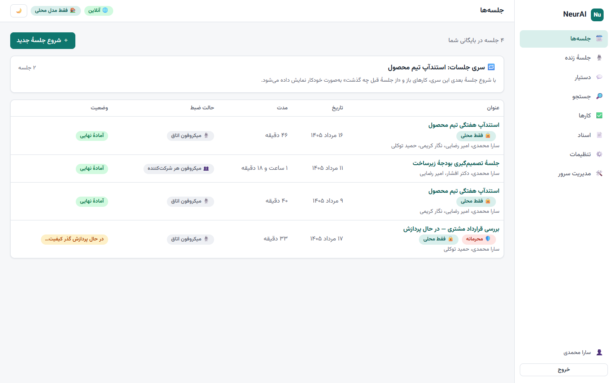
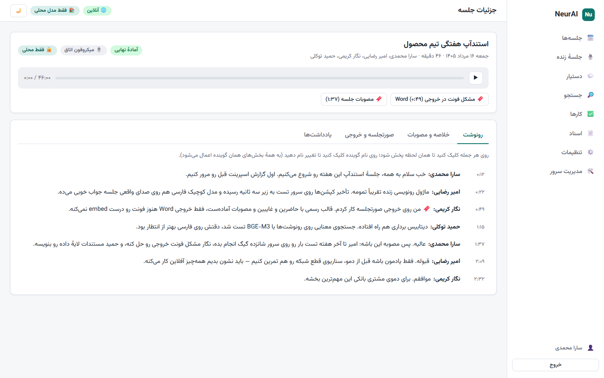
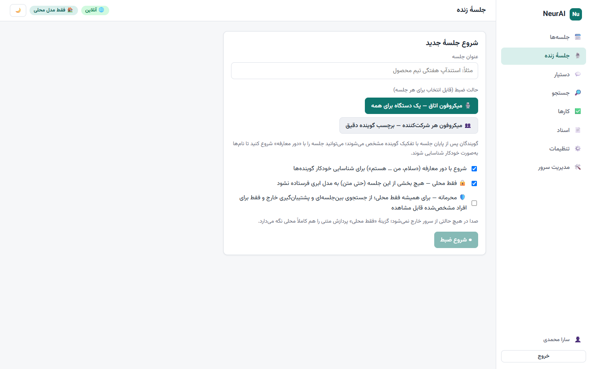
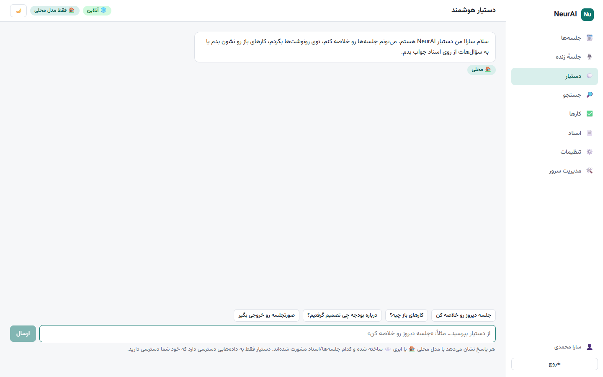
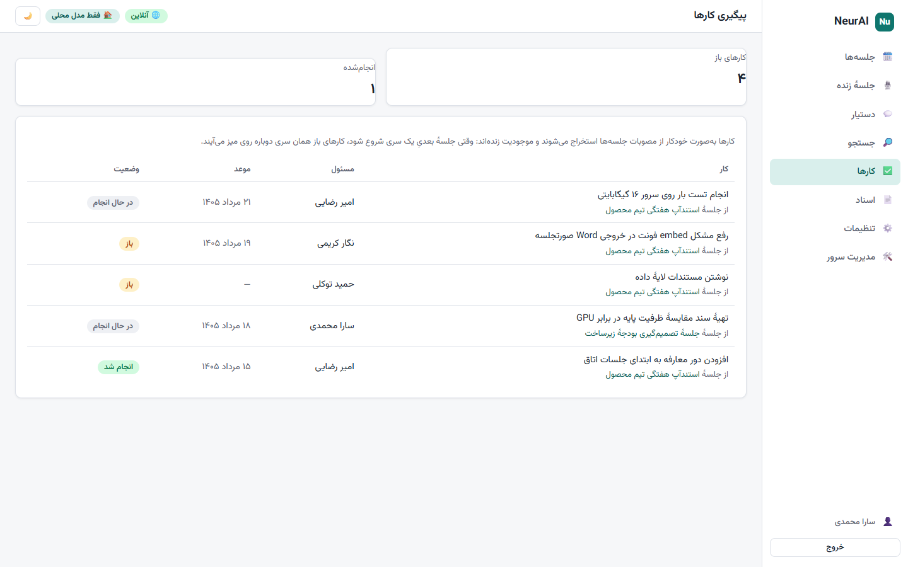
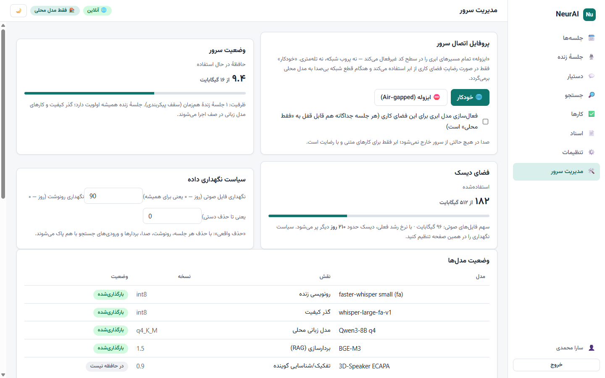
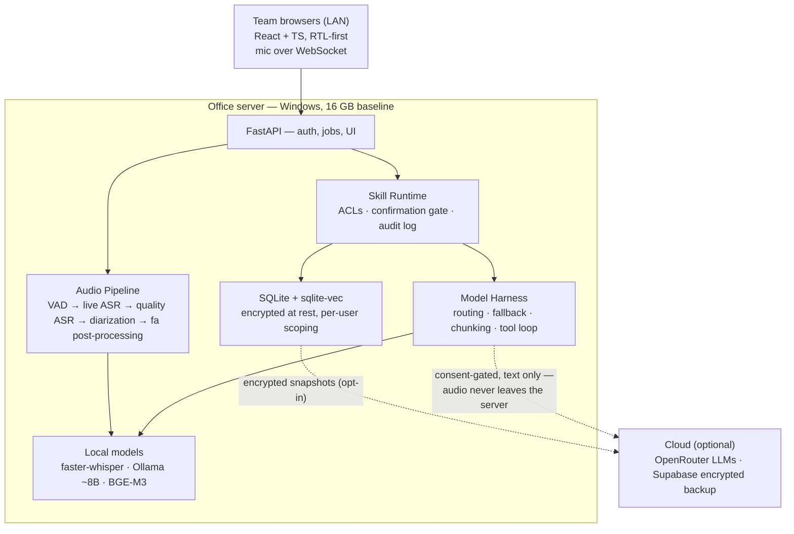

# NeurAI

**دستیار هوش مصنوعی فارسی‌محور، چندکاره و آفلاین** — a Persian-first, offline-capable,
multi-task AI assistant platform for teams, deployed on-premise.

- 🎙️ **Live meeting transcription** in Persian — live captions during the meeting, a
  full-quality transcript with speaker labels minutes after it ends. Fully offline.
  Click any sentence to hear that moment; bookmark key moments live.
- 🧠 **Meeting intelligence** — summaries, decisions, and a live **action-item tracker**
  (assignees, due dates, resurfacing in recurring meetings); cross-meeting search and
  "since last time" recaps
- 📋 **صورتجلسه رسمی** — formal Iranian minutes templates with گفتاری→نوشتاری register
  conversion, Word/PDF export, Jalali dates
- 💬 **Persian chat assistant** and 📄 **document Q&A (RAG)** over your own files
- 🛠️ **Skills (AI-native):** ask in plain Persian — «جلسه دیروز رو خلاصه کن» — and the
  assistant calls the right tools itself; every call runs with *your* permissions, on an
  audited, locked-down skill runtime
- 🏠 **Local-first:** one server on your office network, used from any browser on the LAN;
  runs air-gapped with local models (faster-whisper, Ollama)
- ☁️ **Cloud-enhanced (opt-in):** frontier models via OpenRouter when online and explicitly
  enabled, with automatic fallback to local
- 🔌 **True dual-mode:** one architecture, two runtime profiles — every feature works
  offline; cloud only upgrades text tasks under consent, and audio never leaves the server
  in any mode (admin can lock the server to a fully air-gapped profile)
- 🔄 Optional encrypted snapshot backup — off by default, never required
- 🔒 **Hardened by default:** encrypted at rest, crash-safe recording, signed offline
  updates for air-gapped servers, per-meeting «محرمانه» sensitivity levels — and
  **no telemetry, ever**

## Screenshots

The web UI (RTL-first, Vazirmatn, Jalali dates), running against the demo data set:

| Meetings archive | Meeting transcript |
|---|---|
|  |  |

| Live meeting | Persian chat assistant |
|---|---|
|  |  |

| Action-item tracker | Admin dashboard |
|---|---|
|  |  |

## Architecture at a glance

One on-premise server, browser clients on the LAN, local models by default, cloud as a
consent-gated upgrade. Full detail with all locked decisions (D1–D10):
**[ARCHITECTURE.md](ARCHITECTURE.md)**.



## Repository layout

| Path | Contents |
|---|---|
| [`ARCHITECTURE.md`](ARCHITECTURE.md) | Single source of truth — all decisions (D1–D10), threat model, roadmap |
| [`server/`](server/) | Python FastAPI engine: audio pipeline, model harness, skills runtime, RAG, auth, SQLite layer, tests |
| [`webui/`](webui/) | React + TypeScript client (Vite) — served by the engine in production |
| [`docs/`](docs/) | Screenshots, benchmark results (Phase 0), ADRs |
| [`CLAUDE.md`](CLAUDE.md) | Working agreement for the parallel AI sessions building this project |
| [`.github/workflows/`](.github/workflows/) | CI — lint, tests, Persian eval set with network blocked (offline profile is first-class) |

## Try the UI demo

The web UI runs standalone against mock data (no models needed):

```bash
npm install --prefix webui
npm run dev --prefix webui
```

Open http://localhost:5173 — sign in with any username/password (demo mode).

## Status

🚧 **Design locked (v0.2), build started.** The architecture is in
[ARCHITECTURE.md](ARCHITECTURE.md). Key decisions: on-premise server + browser clients,
two-pass live transcription, 16 GB no-GPU baseline, Windows-first.

The **web UI is built** ([`webui/`](webui/)): React + TypeScript, RTL-first, Vazirmatn,
Jalali dates — all MVP screens (live meeting, transcript + playback, chat with skills and
the confirmation gate, action items, RAG, admin) running against a typed mock of the
future FastAPI engine. See [webui/README.md](webui/README.md).

## Stack

| Layer | Technology |
|---|---|
| Server | Python FastAPI — ASR, harness, RAG, auth. Windows: full one-click installer (service). Linux: Docker Compose |
| Clients | Browser (React + TypeScript, RTL-first) · Tauri thin client later |
| Speech | faster-whisper two-pass (live small model → quality Persian large-v3) + local diarization |
| Local LLMs | Ollama (Qwen3 / Gemma / Aya, ~8B q4 on baseline) |
| Cloud LLMs | OpenRouter (opt-in, consent-gated) |
| Storage | SQLite + sqlite-vec on the server · optional encrypted Supabase backup |

## License

[Apache-2.0](LICENSE).
