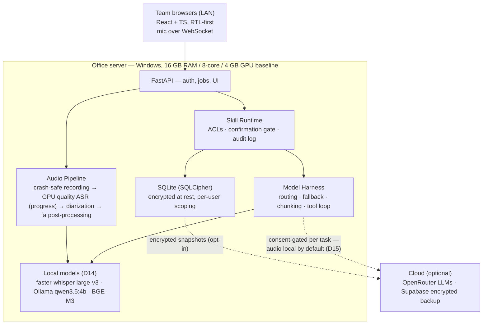

# NeurAI

**دستیار هوش مصنوعی فارسی‌محور، چندکاره و آفلاین** — a Persian-first, offline-capable,
multi-task AI assistant platform for teams, deployed on-premise.

- 🎙️ **Meeting transcription** in Persian — live crash-safe recording (multiple named
  mics per meeting), then one GPU quality pass with a **percent progress bar**; a
  full-quality transcript with speaker labels minutes after the meeting ends. Fully
  offline. Click any sentence to hear that moment; bookmark key moments live.
- 🧠 **Meeting intelligence** — summaries, decisions, and a live **action-item tracker**
  (assignees, due dates, resurfacing in recurring meetings); cross-meeting search and
  "since last time" recaps
- 📋 **صورتجلسه رسمی** — formal Iranian minutes templates with گفتاری→نوشتاری register
  conversion, Word/PDF export, Jalali dates
- 💬 **Persian chat assistant** and 📄 **document Q&A (RAG)** over your own files
- 🛠️ **Skills (AI-native):** ask in plain Persian — «جلسه دیروز رو خلاصه کن» — and the
  assistant calls the right tools itself; every call runs with *your* permissions, on an
  audited, locked-down skill runtime
- 🏠 **Local-first:** one server on your office network (16 GB RAM / 8-core / 4 GB GPU
  baseline), used from any browser on the LAN; runs air-gapped with local models
  (faster-whisper large-v3, Ollama qwen3.5, BGE-M3 — the researched D14 lineup)
- ☁️ **Cloud-enhanced (opt-in):** one admin **Offline/Online switch** (default offline;
  online is probe-gated). Online mode routes per task through OpenRouter — chat/skills on
  claude-sonnet-5, summaries/صورتجلسه on claude-opus-5 — with automatic fallback to local,
  and can optionally transcribe a meeting in the cloud (Groq whisper-large-v3-turbo)
  under an explicit per-meeting «رونویسی ابری» consent (D15)
- 🔌 **True dual-mode:** one architecture, two runtime profiles — every feature works
  offline. **Audio stays on your server by default;** cloud transcription happens only in
  online mode with explicit per-meeting consent (D12-audited, automatic local fallback),
  «محرمانه» meetings refuse it outright, and the admin can lock the server to a fully
  air-gapped profile where no network path exists at all
- 🔄 Optional encrypted snapshot backup — off by default, never required
- 🔒 **Hardened by default:** encrypted at rest, crash-safe recording, signed offline
  updates for air-gapped servers, per-meeting «محرمانه» sensitivity levels — and
  **no telemetry, ever**

## Screenshots

The web UI (RTL-first, Vazirmatn, Jalali dates), running against the demo data set:

| Meetings archive | Meeting transcript |
|---|---|
|  |  |

| Live meeting | Persian chat assistant |
|---|---|
|  |  |

| Action-item tracker | Admin dashboard |
|---|---|
|  |  |

## Architecture at a glance

One on-premise server, browser clients on the LAN, local models by default, cloud as a
consent-gated upgrade. Full detail with all locked decisions (D1–D15):
**[ARCHITECTURE.md](ARCHITECTURE.md)**.



## Repository layout

| Path | Contents |
|---|---|
| [`ARCHITECTURE.md`](ARCHITECTURE.md) | Single source of truth — all decisions (D1–D15), threat model, roadmap |
| [`server/`](server/) | Python FastAPI engine: audio pipeline, model harness, skills runtime, RAG, auth, SQLite layer, tests |
| [`webui/`](webui/) | React + TypeScript client (Vite) — served by the engine in production |
| [`docs/`](docs/) | Screenshots, benchmark results (Phase 0), ADRs |
| [`CLAUDE.md`](CLAUDE.md) | Working agreement for the parallel AI sessions building this project |
| [`.github/workflows/`](.github/workflows/) | CI — offline test suite (encryption active, fake ASR engine); lint + Persian eval set with network blocked planned |

## Try it locally

The web UI talks to the real engine (no AI models needed — ASR/LLM engines are pluggable
and off by default):

```bash
# engine (from server/, in its venv): default port 8471
python -m neurai.main

# web UI dev server (proxies /api and /ws to the engine)
npm install --prefix webui
npm run dev --prefix webui
```

Open http://localhost:5173 — on first run the UI walks you through creating the admin
account.

## Status

🚧 **Design locked (v0.3), engine + UI built against it.** The architecture is in
[ARCHITECTURE.md](ARCHITECTURE.md). Key decisions: on-premise server + browser clients,
live recording + single GPU quality pass with progress (D2 v0.3), the researched D14
model lineup, 16 GB RAM / 8-core / 4 GB GPU baseline, Windows-first.

The **web UI is built and wired to the engine** ([`webui/`](webui/)): React + TypeScript,
RTL-first, Vazirmatn, Jalali dates — first-run setup, one Meetings section (live recording
with named multi-mic registration on top, records under, quality-pass **progress bar**),
transcript with audio-linked playback, a **persistent docked assistant panel** on every
page (skills, confirmation gate, stop button), top-bar semantic search, a Logs page (job
queue + skill audit + D12 security report), action items, document upload/RAG, and the
admin panel, all against the real API (client types generated from `webui/openapi.json`,
D6). See [webui/README.md](webui/README.md).

The **server engine is built** ([`server/`](server/)): auth/sessions (argon2id + lockout),
versioned SQL migrations, crash-safe encrypted recording with a single GPU quality pass
(pluggable ASR, percent progress), consent-gated model harness with cloud→local fallback,
Skill Runtime (ACLs, confirmation gate, audit) incl. **platform-control skills** behind
runtime-enforced admin checks, owner-scoped RAG, صورتجلسه/SRT export, job queue, admin
API with the D12 tamper-evident audit chain, and optional encrypted Supabase backup.
Encryption at rest is default-on: SQLCipher database + sealed AES-256-CTR recordings
(D11). Online mode (D15) is a single admin Offline/Online switch — default offline,
probe-gated (disabled without internet), D12-chained — enabling per-task cloud routing
and the consent-gated cloud ASR path. The offline test suite runs with encryption active;
OpenAPI contract exported to `webui/openapi.json`. See [server/README.md](server/README.md).

## Stack

| Layer | Technology |
|---|---|
| Server | Python FastAPI — ASR, harness, RAG, auth. GPU-first compute with silent CPU fallback (D13). Windows: full one-click installer (service). Linux: Docker Compose |
| Clients | Browser (React + TypeScript, RTL-first) · Tauri thin client later |
| Speech | faster-whisper large-v3 int8 on GPU, single quality pass with progress (strongest open Persian pipeline per the PSRB benchmark; MIT-licensed Persian-turbo fine-tune on a bake-off path) + local diarization (pyannote 3.1) · optional consent-gated cloud ASR in online mode (Groq whisper-large-v3-turbo, D15) |
| Local LLMs | Ollama qwen3.5:4b, think disabled (strongest Persian per GB, native tool calling; qwen3.5:2b floor for guaranteed 4 GB fit) |
| Cloud LLMs | OpenRouter, per-task routing (opt-in, consent-gated): claude-sonnet-5 for chat/skills · claude-opus-5 for summaries/minutes (D15) |
| Embeddings | BGE-M3 — tops Persian FaMTEB for retrieval/rerank |
| Storage | SQLite (SQLCipher) + local vector search on the server · optional encrypted Supabase backup |

## License

[Apache-2.0](LICENSE).
